# Tech Challenge — Fase 2
## Pipeline Híbrido para Análise da Alfabetização no Brasil

**Curso:** Pós-Graduação em Ciência de Dados e IA — FIAP
**Integrante:** Weric Silva

---

## 1. Contexto do Problema

A alfabetização na infância é um dos pilares fundamentais para o desenvolvimento educacional, social e econômico do país. O **Compromisso Nacional Criança Alfabetizada** mobiliza União, estados, Distrito Federal e municípios com o objetivo de garantir que todas as crianças brasileiras estejam alfabetizadas até o final do 2º ano do ensino fundamental.

Em 2023, o **INEP** (Instituto Nacional de Estudos e Pesquisas Educacionais Anísio Teixeira) realizou a *Pesquisa Alfabetiza Brasil*, definindo o ponto de corte de **743 pontos** na escala de proficiência do Saeb como referência de alfabetização. A partir disso, foi criado o **Indicador Criança Alfabetizada**, que mede o percentual de estudantes que atingem esse patamar — com meta nacional de alfabetização universal até 2030.

Compreender os fatores que influenciam esse processo exige integrar múltiplas fontes de dados — metas nacionais, estaduais e municipais, dados territoriais, microdados educacionais e indicadores de desempenho — algo que raramente está disponível de forma unificada e pronta para análise.

## 2. O Desafio Educacional e o Uso do Indicador

Este projeto simula o papel de um time de engenharia de dados de uma organização pública de análise educacional, responsável por construir a infraestrutura que sustenta decisões baseadas em evidência. O Indicador Criança Alfabetizada, sozinho, é apenas um número — seu valor real aparece quando cruzado com metas pactuadas por município, evolução ao longo do tempo, e desigualdades regionais. É esse cruzamento que a arquitetura abaixo entrega.

## 3. Arquitetura Proposta

Adotamos a **Arquitetura Medalhão** (Bronze → Silver → Gold), implementada de forma **serverless** no **Google Cloud Platform**, com ingestão híbrida (batch + streaming simulado).

```mermaid
flowchart TB
    subgraph Fonte["Fonte de Dados"]
        BD["Base dos Dados<br/>(BigQuery público)<br/>br_inep_avaliacao_alfabetizacao"]
    end

    subgraph Batch["Ingestão Batch"]
        B1["etl_bronze.py<br/>7 entidades via basedosdados"]
    end

    subgraph Streaming["Ingestão Streaming (simulada)"]
        S1["Producer<br/>publica eventos"]
        S2["Pub/Sub Topic"]
        S3["Consumer<br/>micro-batches 5s"]
    end

    subgraph Bronze["🟫 Bronze — Dados Brutos"]
        BR["GCS: bronze/&#123;entidade&#125;/ano=YYYY/<br/>+ bronze/alunos_streaming/"]
    end

    subgraph Silver["⬜ Silver — Dados Tratados"]
        SI["etl_silver.py<br/>decodifica, deduplica,<br/>integra, quarentena"]
    end

    subgraph Gold["🟨 Gold — Camada Analítica"]
        GO["etl_gold.py<br/>3 visões agregadas"]
    end

    subgraph Quality["Qualidade de Dados"]
        DQ["data_quality.py<br/>relatório JSON versionado"]
    end

    BD --> B1 --> BR
    BD -.dados de amostra.-> S1
    S1 --> S2 --> S3 --> BR
    BR --> SI --> GO
    SI -.valida.-> DQ
    GO -.valida.-> DQ
```



### Descrição da Arquitetura da Solução

| Camada | Responsabilidade | Tecnologia |
|---|---|---|
| **Bronze** | Ingestão bruta, sem transformação, com metadados de auditoria (`_ingestion_timestamp`, `_source_entity`, `_record_hash`) | Python + `basedosdados` + Cloud Storage |
| **Silver** | Decodificação via dicionário de domínio, tratamento de nulos, deduplicação, normalização de chaves, integração entre tabelas, quarentena de registros órfãos | Python (pandas) |
| **Gold** | Agregações analíticas prontas para consumo (dashboards, ML) | Python (pandas) |
| **Streaming** | Simulação de chegada incremental de novas medições de desempenho | Google Pub/Sub |
| **Qualidade** | Validações formais e relatório de auditoria | Python + Cloud Storage (JSON versionado) |

### Fluxo de Dados

1. As 7 entidades exigidas (UF, metas Brasil/UF/Município, Município, Alunos + Dicionário de apoio) são extraídas do BigQuery público da Base dos Dados e gravadas na **Bronze**, particionadas por ano.
2. Paralelamente, uma simulação de **streaming** publica eventos individuais (novas medições de desempenho) via Pub/Sub, consumidos em micro-batches e também gravados na Bronze — demonstrando o padrão de ingestão híbrida.
3. A **Silver** lê a Bronze, decodifica códigos usando a tabela de dicionário, remove duplicatas, padroniza tipos, e integra `alunos` + `municipio` + `meta_alfabetizacao_municipio` via join. Registros sem correspondência referencial válida são isolados em quarentena, não descartados.
4. A **Gold** consome a Silver integrada e gera três visões: indicador de alfabetização por município, comparação meta vs. resultado nacional, e evolução temporal por município.
5. Um script de **qualidade de dados** roda após o pipeline, validando nulos, duplicidade, integridade referencial e consistência entre camadas, gerando um relatório JSON auditável.

## 4. Tecnologias Utilizadas

| Ferramenta | Por que foi escolhida |
|---|---|
| **Google Cloud Platform** | Créditos de trial cobrem todo o projeto; a fonte de dados (Base dos Dados) já vive nativamente no BigQuery do GCP, eliminando etapas de transferência |
| **BigQuery (dataset público `basedosdados`)** | Acesso direto às tabelas oficiais via SQL, sem necessidade de download manual de arquivos |
| **Cloud Storage** | Datalake serverless, sem custo de infraestrutura ociosa, com tier gratuito permanente |
| **Python + pandas** | Volume de dados (~3,9M registros na maior tabela) processado em minutos localmente, sem necessidade de cluster distribuído — ver seção de trade-offs |
| **Google Pub/Sub** | Serviço de mensageria serverless nativo do GCP, usado para simular ingestão streaming sem overhead de gerenciar um cluster Kafka |
| **Parquet + particionamento por ano** | Formato colunar comprimido, leitura seletiva por partição, redução de custo e tempo de I/O |
| **Git/GitHub (branches `main`/`develop`, PRs)** | Rastreabilidade da evolução do pipeline, fluxo de revisão em equipe |

## 5. Decisões Arquiteturais (Trade-offs)

### Batch vs. Streaming
A maior parte das fontes (metas, municípios, dados agregados) são publicadas em ciclos anuais fixos pelo INEP — não há ganho real em tratá-las como streaming. Optamos por **batch para as 7 entidades estruturais**, e implementamos uma **simulação de streaming via Pub/Sub** especificamente para o cenário de "nova medição de desempenho chegando", que é o caso de uso descrito no próprio desafio. Não usamos Kafka: ele exigiria um cluster próprio (VM dedicada ou serviço externo como Confluent Cloud) para um volume que não justifica esse custo operacional — Pub/Sub resolve o mesmo padrão conceitual (tópico, producer, consumer) de forma totalmente serverless.

### Spark vs. Pandas
Avaliamos usar PySpark via Dataproc Serverless para a camada Silver, especialmente para o join entre `alunos` e `municipio`. Medimos os tempos reais: a extração de ~3,9 milhões de registros do BigQuery levou a maior parte do tempo do pipeline (~11 minutos), majoritariamente por I/O de rede — não por processamento. O processamento em si (decodificação, join, deduplicação) rodou em menos de 2 minutos localmente com pandas, sem sinais de limitação de memória. Introduzir Spark replicaria a mesma lógica com maior tempo de provisionamento de infraestrutura e custo adicional, sem ganho de performance mensurável para esse volume. Reservamos Spark como estratégia de escala futura, caso o pipeline incorpore fontes maiores (ex: microdados completos do Censo Escolar).

### Data Lake vs. Data Warehouse
Optamos por **Data Lake (Cloud Storage + Parquet)** como base do pipeline, em vez de materializar tudo direto em um Data Warehouse (BigQuery próprio). Isso preserva flexibilidade para reprocessar camadas anteriores sem custo de storage de warehouse, e mantém a arquitetura Medalhão explícita em três camadas fisicamente separadas — mais alinhado ao que o desafio pede. O BigQuery público segue sendo usado como **fonte**, não como destino do pipeline.

### Custo vs. Performance
Priorizamos serviços serverless (Cloud Storage, Pub/Sub, BigQuery sob demanda) em toda a arquitetura, evitando qualquer recurso que precise ser "lembrado de desligar". A única exceção avaliada (Dataproc Serverless) foi descartada por não trazer ganho de performance proporcional ao custo, reforçando a escolha por simplicidade operacional.

## 6. Monitoramento e FinOps

**Monitoramento:** todos os scripts (`etl_bronze.py`, `etl_silver.py`, `etl_gold.py`, `streaming_consumer.py`, `data_quality.py`) implementam logging estruturado, registrando volumes processados, tempo de execução e falhas por etapa. O script de qualidade de dados gera um **relatório JSON versionado** (`quality/reports/`), funcionando como auditoria histórica executável a qualquer momento. Falhas críticas de qualidade interrompem o pipeline (`raise Exception`), evitando que dados inconsistentes avancem silenciosamente para a camada Gold.

**FinOps:**
- Uso de **Parquet particionado por ano** em todas as camadas, reduzindo volume de leitura/custo em consultas futuras.
- Arquitetura 100% **serverless** (Cloud Storage, Pub/Sub, BigQuery sob demanda) — sem VM ou cluster fixo ligado.
- **Budget alert** configurado no projeto GCP para evitar surpresas de cobrança.
- Decisão consciente de **não usar Spark/Dataproc** neste volume, evitando custo de infraestrutura desproporcional ao ganho.
- Todos os recursos usados (bucket, tópico Pub/Sub) podem ser desligados/excluídos após a avaliação, sem perda do código-fonte ou das evidências (prints, logs, vídeo).

## 7. Aplicação em IA

A camada Gold, já limpa, integrada e agregada, está pronta para alimentar:

- **Modelos de predição de alfabetização:** as visões `indicador_por_municipio` e `evolucao_temporal_municipio` podem servir de base para um modelo de classificação/regressão que prevê a taxa de alfabetização esperada de um município no ano seguinte, usando como features o histórico de proficiência, taxa de participação e características territoriais (se enriquecido com dados do IBGE/Censo Escolar).
- **Análise de desigualdade educacional:** a comparação entre municípios na visão `indicador_por_municipio`, cruzada com dados socioeconômicos externos (ex: Atlas do Desenvolvimento Humano), permite identificar clusters de vulnerabilidade educacional via algoritmos de agrupamento (k-means, clustering hierárquico).
- **Políticas públicas baseadas em dados:** a visão `meta_vs_resultado_brasil`, com o campo `gap_para_meta_2030`, permite priorizar investimento público nos municípios/estados mais distantes da meta nacional, com atualização automática a cada novo ciclo de dados processado pelo pipeline.

## 8. Qualidade de Dados — Achado Real

Durante a validação de integridade referencial, identificamos 410 registros de alunos (0,01% da base) associados ao código de município `5219308` (Santa Isabel/GO) sem correspondência na tabela de referência de municípios daquele ano/rede. Investigação confirmou tratar-se de um código IBGE válido — a ausência é uma lacuna da própria fonte de dados, não um erro de processamento. Os registros foram isolados em `silver/alunos_quarentena/`, preservando rastreabilidade, e o restante da base (3.867.589 registros) seguiu validado com **score de qualidade de 100%**.

## 9. Demonstração — Ingestão Streaming

[Assista à demonstração do producer/consumer rodando em tempo real](https://github.com/infod3-ws/fiap-tech-challenge-fase2/releases/download/v0.1-fiap-tc2-strm-demo/FIAP_TC2_Consumer_Producer_Simulation.mov)

O vídeo mostra o producer publicando 200 eventos simulados no tópico Pub/Sub e o consumer processando em micro-batches de ~5 segundos, gravando na camada Bronze particionada por data de ingestão, sem perda de mensagens.

## 10. Documentação Técnica Complementar

Além deste README (visão geral e decisões de arquitetura), o projeto inclui:

| Arquivo | Conteúdo |
|---|---|
| [`docs/dicionario_dados.md`](docs/dicionario_dados.md) | Significado de cada coluna, incluindo os códigos decodificados via tabela `dicionario` da fonte |
| [`docs/setup_ambiente.md`](docs/setup_ambiente.md) | Passo a passo de reprodução do ambiente: autenticação GCP, criação de infraestrutura, ordem de execução dos scripts |
| [`docs/relatorio_qualidade_100.json`](docs/relatorio_qualidade_100.json) | Cópia estática de uma execução real do `data_quality.py`, com score de 100% |
| [`docs/relatorio_qualidade_erro.json`](docs/relatorio_qualidade_erro.json) | Cópia estática de uma execução real do `data_quality.py`, com erro de integridade referencial |
| [`requirements.txt`](requirements.txt) | Dependências Python necessárias para rodar os scripts (`pip install -r requirements.txt`) |
| [`bronze/README.md`](bronze/README.md), [`silver/README.md`](silver/README.md), [`gold/README.md`](gold/README.md) | Documentação de cada camada da arquitetura Medalhão: entidades, paths reais no GCS, scripts responsáveis |

## 11. Estrutura do Repositório

```
├── bronze/
│   └── README.md                    # documentação da camada (entidades, paths, schema)
├── silver/
│   └── README.md
├── gold/
│   └── README.md
├── quality/
│   └── data_quality.py              # validações formais + relatório JSON
├── scripts/
│   ├── etl_bronze.py                # ingestão batch das 7 entidades
│   ├── etl_silver.py                # tratamento, decodificação, integração, quarentena
│   ├── etl_gold.py                  # 3 visões analíticas agregadas
│   ├── streaming_producer.py        # simulação de eventos via Pub/Sub
│   └── streaming_consumer.py        # consumo em micro-batches
├── docs/
│   ├── dicionario_dados.md          # significado de cada coluna/código
│   ├── setup_ambiente.md            # reprodução do ambiente do zero
│   └── relatorio_qualidade_100.json
│   └── relatorio_qualidade_erro.json
├── requirements.txt                 # dependências Python
├── .gitignore
└── README.md
```

## 12. Apresentação Executiva da Plataforma

[Assista a apresentação executiva da plataforma](https://github.com/infod3-ws/fiap-tech-challenge-fase2/releases/download/v0.1-fiap-tc2-apresentacao/FIAP_POSTECH_TC2_Weric_Silva_Apresentacao.mp4)

O vídeo de 5 minutos apresenta a plataforma em formato executivo exibindo desde o problema inicial, a solução adotada, a arquitetura empregada até as conclusões obtidas.